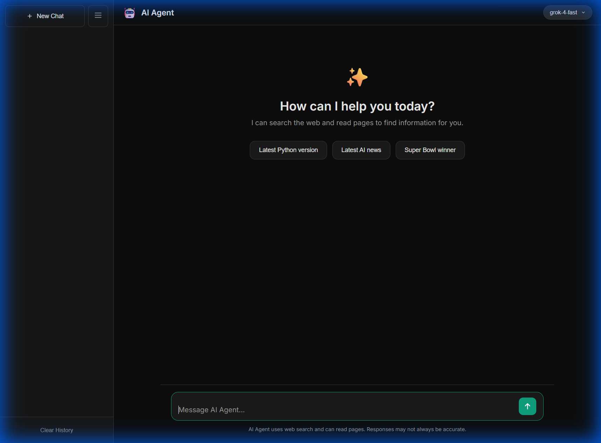
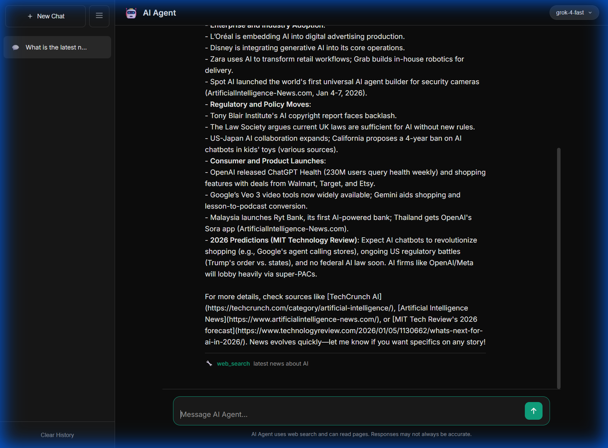
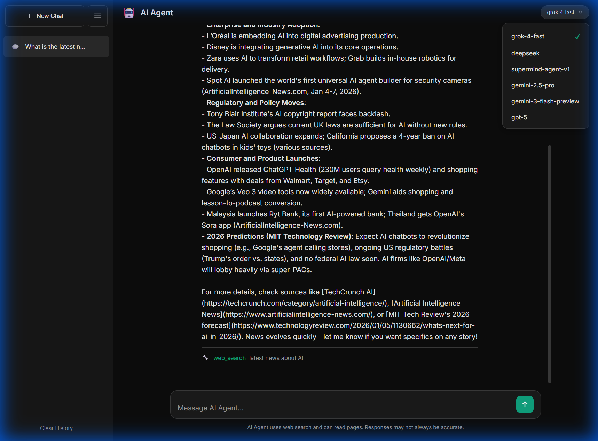

# Agent-Based FastAPI Chat Application

A FastAPI application featuring agentic AI chat capabilities with web search tools.

## Screenshots

### Chat Interface
A modern, clean chat interface with quick action buttons.



### AI Agent in Action
The agent uses web search to find real-time information and provides detailed responses with citations.



### Multiple Model Support
Switch between different AI models including grok-4-fast, deepseek, gemini-2.5-pro, and gpt-5.



## Features

- 🤖 **Agentic Chat**: AI-powered chat using multiple LLM models (grok-4-fast, deepseek, gemini-2.5-pro, gpt-5, etc.)
- 🔍 **Web Search Tool**: Real-time web search integration via AI Builder Search API
- 📄 **Page Reader Tool**: Fetch and extract content from web pages
- 📚 **Personal Notes Search**: `query_my_notes` tool for searching your indexed personal knowledge base
- 🎨 **Modern UI**: Beautiful chat interface with model switcher and chat history
- 🐳 **Docker Ready**: Includes Dockerfile for containerized deployment

## Tech Stack

- **Backend**: FastAPI, Python 3.x
- **AI Integration**: OpenAI-compatible API (AI Builder)
- **Frontend**: Vanilla HTML/CSS/JavaScript
- **HTTP Client**: httpx

## Getting Started

### Prerequisites

- Python 3.8+
- AI Builder Token

### Installation

1. Clone the repository:
```bash
git clone https://github.com/kkekekeco/agent-based-on-fast-api.git
cd agent-based-on-fast-api
```

2. Create virtual environment:
```bash
python -m venv .venv
.venv\Scripts\activate  # Windows
# or
source .venv/bin/activate  # Linux/Mac
```

3. Install dependencies:
```bash
pip install -r requirements.txt
```

4. Create `.env` file:
```
AI_BUILDER_TOKEN=your_token_here
```

5. Run the server:
```bash
fastapi dev main.py
```

6. Open http://127.0.0.1:8000 in your browser

## API Endpoints

| Method | Endpoint | Description |
|--------|----------|-------------|
| GET | `/` | Chat UI |
| GET | `/welcome/{name}` | Welcome message |
| POST | `/agent/chat` | Agentic chat endpoint |
| POST | `/admin/reload-index` | Reload notes index without restart |

## Personal Notes Integration

This FastAPI app integrates with the `202601-doc-retrival` project to enable searching your personal knowledge base.

**Setup:**
1. Build index using the indexer in `202601-doc-retrival` project
2. Place index file at `../202601-doc-retrival/my_notes.index`
3. The agent will automatically use `query_my_notes` tool when appropriate

**Update Index:**
When you add new files to `../202601-doc-retrival/docs/`, rebuild the index:
- Windows: `cd ../202601-doc-retrival && .\refresh_index.ps1`
- Mac/Linux: `cd ../202601-doc-retrival && ./refresh_index.sh`
- Or manually: `python indexer.py` then call `/admin/reload-index` endpoint

## Mac Setup

```bash
# Clone repository
git clone https://github.com/kkekeke/202601-fastapi.git
cd 202601-fastapi

# Setup
python3 -m venv venv
source venv/bin/activate
pip install -r requirements.txt

# Configure
cp .env.example .env
# Edit .env and add your AI_BUILDER_TOKEN

# Ensure index exists (from 202601-doc-retrival project)
# Should be at: ../202601-doc-retrival/my_notes.index

# Run
export AI_BUILDER_TOKEN="your-key"
python -m uvicorn main:app --reload --host 127.0.0.1 --port 8000
```

## Docker Deployment

```bash
docker build -t fastapi-agent .
docker run -p 8000:8000 -e AI_BUILDER_TOKEN=your_token fastapi-agent
```

## License

MIT
